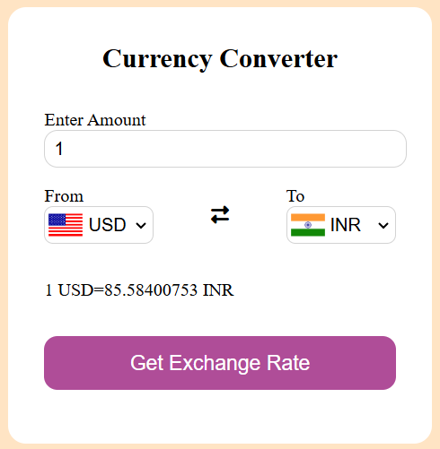

# 🌐 Currency Converter with Flags

A simple, responsive currency converter that uses real-time exchange rates and displays country flags dynamically.

 

## 🚀 Features

- 🌍 Real-time exchange rates (via [Fawaz Ahmed Currency API](https://github.com/fawazahmed0/currency-api))
- 🏳 Country flags dynamically shown using [FlagsAPI](https://flagsapi.com/)
- 🔁 Swappable “From” and “To” currencies
- 📱 Mobile responsive UI

## 📁 Files

| File        | Purpose                         |
|-------------|---------------------------------|
| `index.html`| Main layout and structure       |
| `style.css` | Styles and responsive design    |
| `codes.js`  | Country-to-currency and flag map|
| `app.js`    | API call, dropdown logic, output|

## 🔧 How to Use

1. Clone or download this repo.
2. Open `index.html` in your browser.
3. Select currencies and click "Get Exchange Rate".

## 📦 API & Resources

- 💱 Exchange Rates: [Fawaz Ahmed Currency API](https://github.com/fawazahmed0/currency-api)
- 🏁 Flags: [https://flagsapi.com](https://flagsapi.com)

## 👨‍💻 Author

Built with ❤️ by *Your Name*

## 📸 Screenshot

---

### 🔗 [Live Demo (Optional)](https://your-demo-link.netlify.app)
